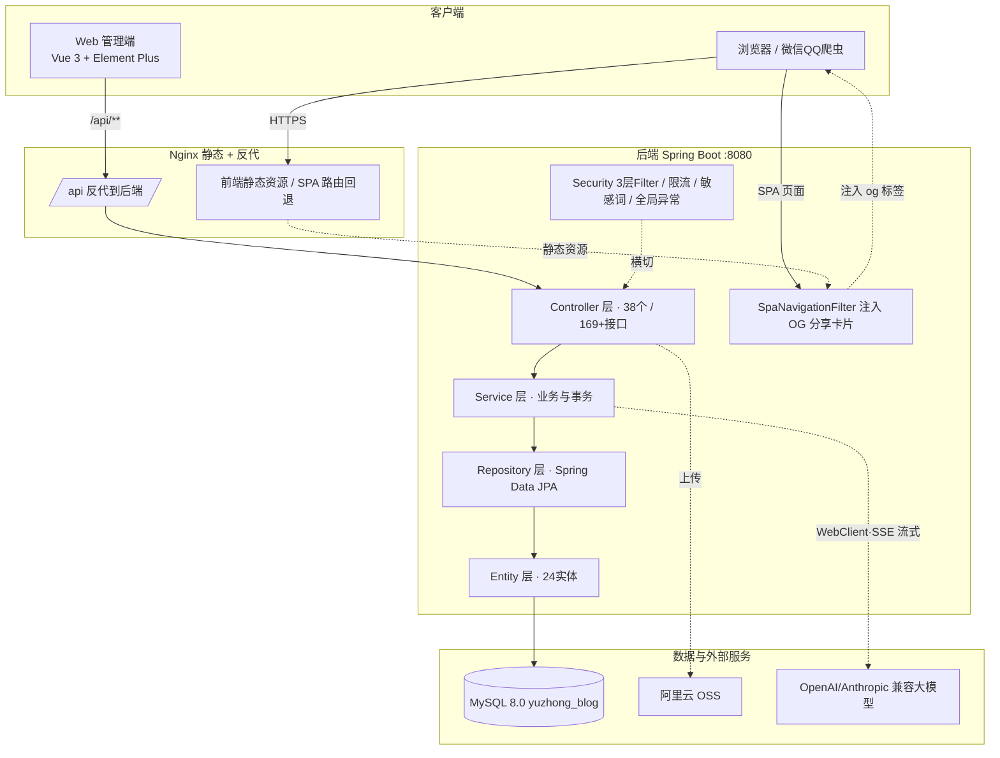
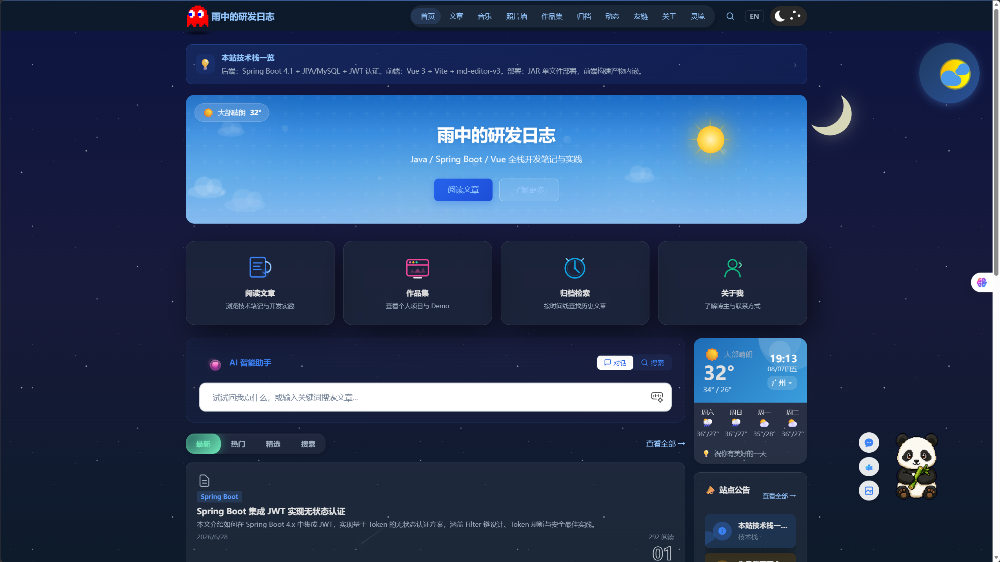
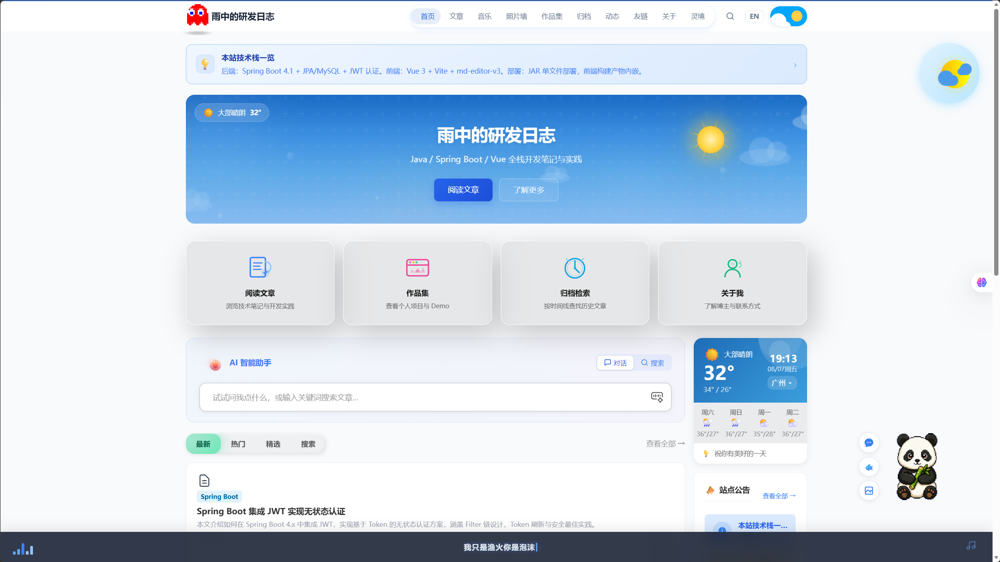
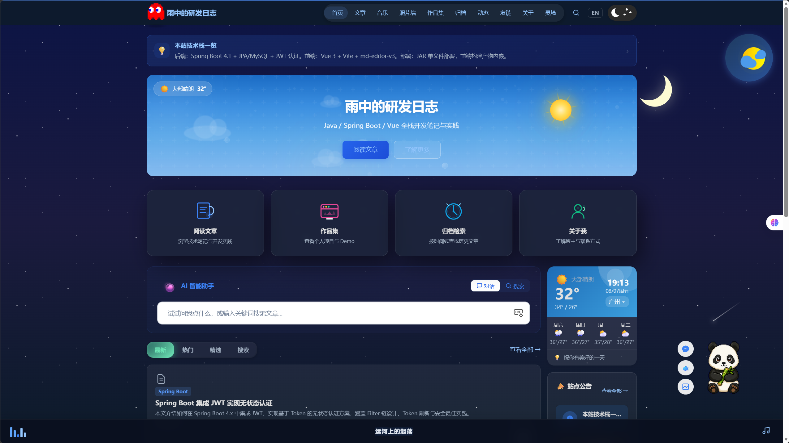
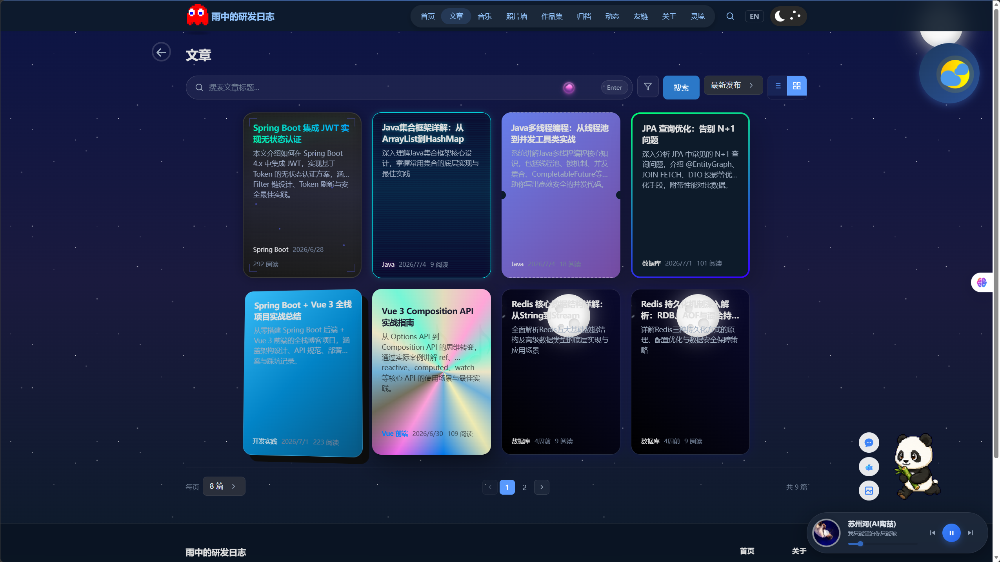
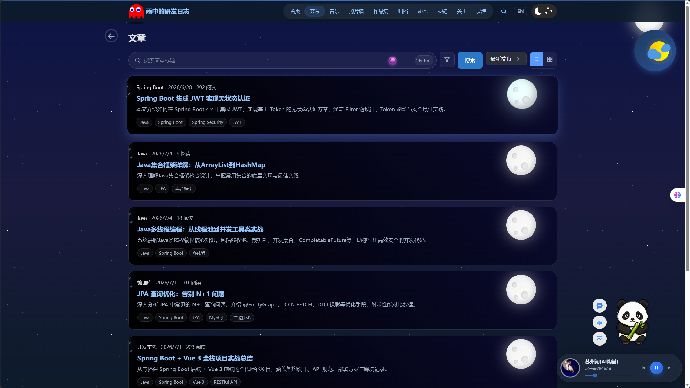
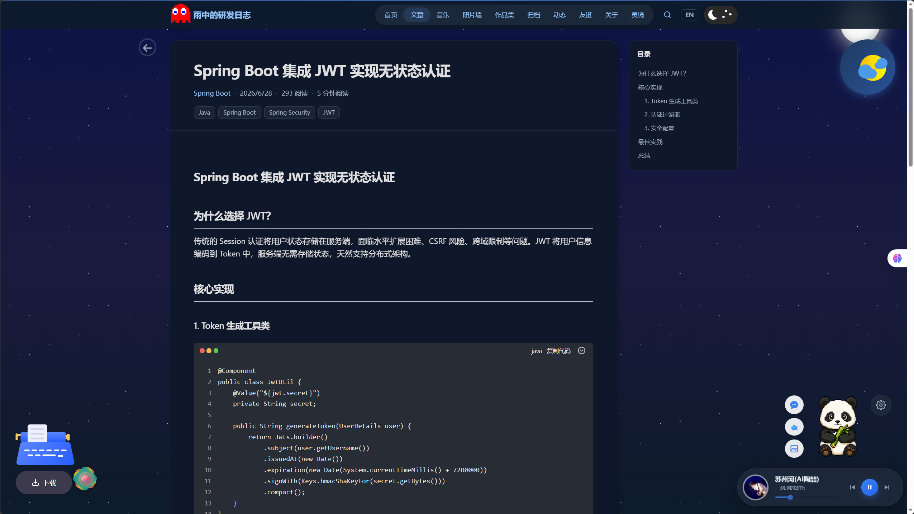
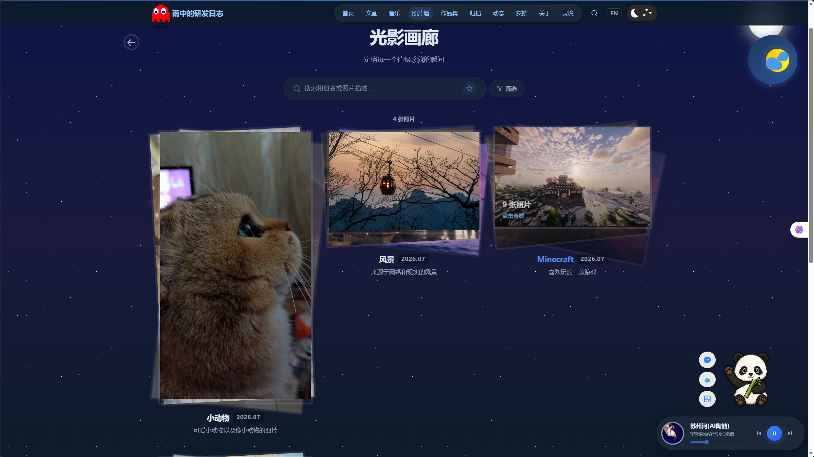
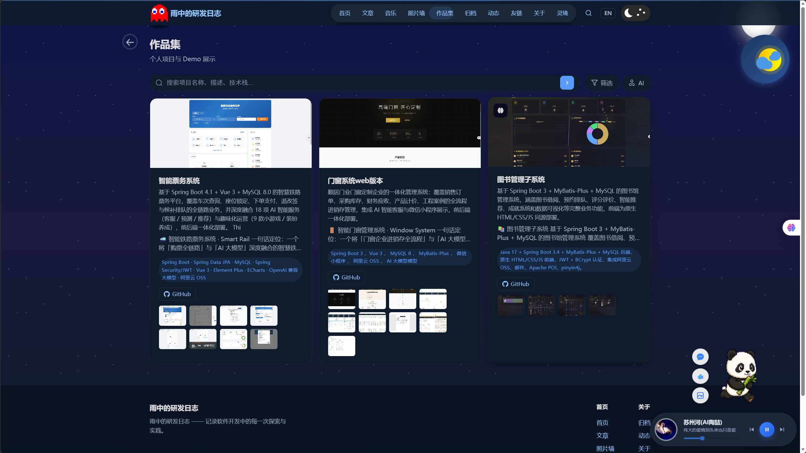

<div align="center">

# 🐼 雨中的研发日志 · YuzhonBlog

**个人博客与内容创作平台：文章创作 · 作品集展示 · 动态时间线 · 相册图库 · 音乐电台 · AI 智能助手 · 多语言与主题切换 · 分享卡片**


**从文章的发布分享，到作品集的展示、动态的记录、相册与音乐的收藏，再到 AI 助手的智能问答与写作——一个前后端分离、功能完整的现代化个人博客。**

🔗 在线演示：[https://shunjumc.cn](https://shunjumc.cn) · 📦 开源仓库：[GitHub](https://github.com/YZzy2006/YuzhongBlog)

</div>

---

## ✨ 功能亮点

| | | |
|---|---|---|
| ✍️ **文章创作** | 🎨 **作品集展示** | 📅 **动态时间线** |
| Markdown 编辑器 · 分类标签 · 多语言 · SEO 分享卡片 | 项目卡片 · 封面图 · 技术栈 · 截图画廊 | 短记录 · 心情 · 图片 · 时间轴 |
| 📷 **相册图库** | 🎵 **音乐电台** | 🤖 **AI 智能助手** |
| 云相册 · OSS 存储 · 相册管理 | Bilibili 集成 · 歌词滚动 · 封面 | 多提供商 SSE 流式 · 写作/翻译/分析 |
| 🌙 **主题与多语言** | 🛡️ **安全体系** | 🌌 **互动体验** |
| 自动暗色 · i18n 中英 | JWT · 限流 · 敏感词 · AES 加密 · 内容审核 | 星空宇宙 · 宠物 · 在线游戏 |

---

## 📑 目录

- [一、项目背景](#一项目背景)
- [二、系统架构](#二系统架构)
- [三、核心功能模块](#三核心功能模块)
- [四、关键技术点与难点解决](#四关键技术点与难点解决)
- [五、数据模型设计](#五数据模型设计24-个实体)
- [六、工程结构一览](#六工程结构一览)
- [七、快速运行指南](#七快速运行指南)
- [八、环境变量配置](#八环境变量配置)
- [九、常见问题 FAQ](#九常见问题-faq)
- [十、项目亮点总结](#十项目亮点总结)
- [十一、项目收获与反思](#十一项目收获与反思)
- [十二、界面预览](#十二界面预览)

---

## 一、项目背景

写博客不只是记录，更是一个持续打磨技术的过程。从最初的单页展示，逐步迭代成**集内容创作、作品集、动态、相册、音乐、AI 于一体**的完整平台。

本项目以"一个人也要做好内容平台"为理念，围绕**创作 → 展示 → 互动 → 沉淀**的闭环展开：

- ✍️ 写文章、发动态、收录作品集 → 内容沉淀
- 🎨 相册、音乐、主题、多语言 → 体验打磨
- 🤖 AI 助手、智能搜索、语义问答 → 智能增强
- 🔗 分享卡片、社交链接、留言互动 → 对外传播

---

## 二、系统架构

### 1. 技术选型总览

| 层面 | 技术 | 选型理由 |
|------|------|----------|
| 语言 | Java 17 | 稳定、生态成熟，企业级后端标准 |
| 框架 | Spring Boot 4.1.0 | 自动装配 + 约定优于配置，快速迭代 |
| 持久层 | Spring Data JPA + Hibernate 7 | 实体驱动建模，复杂查询可写 JPQL |
| 数据库 | MySQL 8.0 | 关系型数据模型，保障内容一致性 |
| 认证 | JWT (jjwt 0.12.6) | 无状态令牌，3 层过滤器链 + Token 刷新 |
| 密码加密 | BCrypt | 加盐哈希，抗彩虹表攻击 |
| 字段加密 | AES-256-GCM | 敏感配置（OSS / AI 密钥）加密存储 |
| AI 大模型 | OpenAI / Anthropic 兼容协议 | WebClient 异步 + SSE 流式，多模型可配置 |
| 对象存储 | 阿里云 OSS | 文章封面 / 相册 / 头像云端存储 |
| 前端 | Vue 3 + Vite + Element Plus + Pinia | 组件化 + 状态管理 |
| 可视化 | ECharts 6 + md-editor-v3 + three.js | 数据看板 + Markdown + 星空交互 |
| 安全 | Spring Security + sensitive-word | 认证授权 + 敏感词过滤 + 内容审核 |

### 2. 系统架构图



### 3. 分层架构

经典**四层架构**，职责清晰、易于测试与扩展：

```
Controller（接口层） → Service（业务层） → Repository（数据访问） → Entity → MySQL
                          ↕
   Security 过滤器链 / 限流 / 敏感词过滤 / 内容审核 / 全局异常 / OG 注入
```

- **Controller 层**：38 个 REST 控制器（公开端 + 管理端）、169+ 接口，统一返回 `ApiResponse`
- **Service 层**：核心业务逻辑与事务边界（`@Transactional`），36 个 Service 类
- **Repository 层**：Spring Data JPA，24 个 Repository，复杂查询用 JPQL + `@EntityGraph`
- **横切关注点**：JWT 无状态认证、登录 / AI / 通用三级限流、敏感词过滤、AI 内容审核、AES-256-GCM 加解密、文件上传 magic-byte 校验、SSRF 防护、全局异常处理

### 4. 前后端分离部署

前端 Vue 3 构建产物输出到 `src/main/resources/static/`，生产环境由 **nginx 直接提供静态资源**，SPA 页面请求反代到后端注入分享卡片 OG 标签；后端独立 JAR 监听 **8080**。开发模式下前端运行于 **5173**，通过 Vite 代理 `/api` 与 `/admin` 到 8080。

---

## 三、核心功能模块

### 1️⃣ 文章创作系统

- Markdown 编辑器（md-editor-v3）+ 实时预览 + 图片上传
- 分类 / 标签 / 置顶 / 发布时间管理，全文检索
- **SEO 分享卡片**：文章链接分享到微信 / QQ 自动生成标题 + 摘要 + 封面
- 多语言内容（中 / 英标题与摘要自适应）

### 2️⃣ 作品集展示

- 项目卡片（封面 / 副标题 / 技术栈 / 链接），精选项目置顶展示
- 项目详情：Markdown 介绍 + 功能特性 + **截图画廊灯箱**
- 分享卡片：项目链接分享自动带项目名 / 简介 / 封面

### 3️⃣ 动态与时间线

- 短动态记录：文字 + 图片 + 心情 + 分类
- 时间轴归档（Archive），按月检索
- 点赞、浏览计数，动态详情页

### 4️⃣ 相册图库

- 云相册：封面 + 多图，OSS 云端存储
- 相册管理（后台）、图片灯箱浏览、懒加载

### 5️⃣ 音乐电台

- **Bilibili 集成**：视频号点歌，音乐列表 + 歌词滚动
- 封面自动裁切、自定义歌曲封面覆盖、本地歌单管理

### 6️⃣ AI 智能助手

| 方向 | 功能 |
|------|------|
| 对话助手 | 全站 AI 对话（SSE 流式），多轮上下文记忆 |
| 创作辅助 | 文章 / 项目 / 动态写作助手：生成、润色、扩写、压缩、翻译、改写 |
| 语义搜索 | 文章 / 动态 / 项目 AI 语义检索，自然语言筛选 |
| 模型管理 | 多提供商配置（API 地址 / 模型 / 密钥），密钥 AES-256-GCM 加密存储，余额查询 |

> 💡 统一通过 `WebClient` 调用 OpenAI / Anthropic 兼容协议大模型，`SseEmitter` 流式输出；支持 DeepSeek、Kimi、通义百炼等多家，管理后台可视化配置。

### 7️⃣ 全局搜索

- 全文搜索（文章 / 动态 / 项目）+ **AI 语义搜索**（自然语言意图解析）
- 命令面板（Command Palette）快捷检索

### 8️⃣ 管理后台

- 运营看板（ECharts 仪表盘）：文章 / 访问 / 互动统计
- 内容管理：文章、分类、标签、作品集、动态、相册、公告、友链、留言
- 系统管理：站点设置、AI 配置、OSS 配置、天气配置、用户与角色权限（RBAC）
- 运维能力：SQL 一键备份恢复、登录日志、内容审核记录

### 9️⃣ 系统安全与运维

- **JWT 认证**：无状态 3 层过滤器链（登录限流 → 管理端校验 → 公开放行），Access Token 刷新，跨标签页会话同步
- **登录限流**：IP 维度滑动窗口 + 验证码，登录端点独立限流
- **接口限流**：登录 / AI / 通用 API 分级限流
- **内容安全**：敏感词过滤（多语言）+ **AI 内容审核**（发布前自动审查）
- **数据安全**：密码 BCrypt、敏感配置 AES-256-GCM、密钥环境变量化、`.gitignore` 排除本地产物
- **文件安全**：上传 magic-byte 校验、SVG 附件防护、OSS 签名
- **安全响应头**：CSP / X-Frame-Options / X-Content-Type-Options 等；机器人检测

---

## 四、关键技术点与难点解决

### 1. SPA 分享卡片（OG 注入）

微信 / QQ 抓取链接靠的是 HTML `<head>` 里的 `og:` 标签。SPA 页面由 nginx 直接返回静态 `index.html`，爬虫抓不到动态内容。

**解决**：`SpaNavigationFilter` 拦截非 API 页面请求，后端从 `app.spa.index-path` 读取 `index.html`，`OgMetaService` 按路由（文章 / 项目 / 动态）注入 `og:title / og:description / og:image`，并给 OSS 图片追加 `x-oss-process` 压缩参数。nginx 配置 `try_files $uri @backend` 让页面请求反代到后端注入。

### 2. JWT 无状态认证 + 3 层过滤器链

`SecurityConfig` 按顺序声明 3 条 filter 链：**登录（限流）→ 管理端（JWT 校验）→ 默认（公开放行）**。Access Token 2h + 刷新机制，`JwtAuthenticationFilter` 解析 Bearer Token，实现无状态、可水平扩展的认证。

### 3. 三级限流防滥用

- **登录接口**：`LoginRateLimiter` IP 滑动窗口，独立限流
- **AI 接口**：独立限流，防止大模型接口被刷
- **通用 API**：滑动窗口 + 定时清理过期窗口

### 4. AI 多提供商集成

- `WebClient` 异步调用 + `SseEmitter` 流式输出，对话逐字返回
- `CompletableFuture.orTimeout(30s)` 兜底，LLM 超时不拖垮主流程
- 多提供商抽象（OpenAI / Anthropic 兼容），密钥 AES-256-GCM 加密落库，管理后台可视化配置与连通性测试

### 5. 安全设计（可放心开源）

- ✅ BCrypt 加盐加密存储密码，不存明文
- ✅ **数据库密码、JWT 密钥、AES 密钥、OSS / AI 密钥全部环境变量注入，代码零明文**
- ✅ OSS / AI 等敏感配置 AES-256-GCM 加密存储于数据库（自动加解密）
- ✅ 发布内容 AI 审核 + 敏感词多语言过滤
- ✅ 文件上传 magic-byte 校验，防 Content-Type 伪装
- ✅ IP 滑动窗口限流；SSRF 防护；安全响应头
- ✅ 本地含密钥文件、SQL 数据、构建产物均通过 `.gitignore` 排除，仓库可安全公开

---

## 五、数据模型设计（24 个实体）

| 域 | 表 / 实体 | 职责 |
|----|-----------|------|
| 内容域 (12) | `article` / `category` / `tag` / `article_tag` / `article_like` / `project` / `timeline_entry` / `timeline_like` / `announcement` / `friend_link` / `content_review` / `report` | 文章、分类标签、作品集、动态、公告、友链、内容审核、举报 |
| 媒体与音乐 (4) | `photo` / `photo_album` / `music_custom_song` / `song_cover_override` | 相册照片、音乐歌单、封面覆盖 |
| 用户与权限 (3) | `admin_user` / `user_permission` / `phone_binding` | 管理员、RBAC 权限、手机绑定 |
| 系统与配置 (5) | `site_setting` / `ai_config` / `weather_config` / `login_log` / `backup_record` | 站点 KV 配置、AI 模型、天气、登录日志、备份 |

**核心 ER 关系：**

```
Category 1──N Article N──M Tag（article_tag）
Article 1──N ArticleLike        TimelineEntry 1──N TimelineLike
PhotoAlbum 1──N Photo            Article 1──1 ContentReview（AI 审核）
AdminUser N──M UserPermission    SiteSetting 1──N key-value 通用配置
```

---

## 六、工程结构一览

```
YuzhonBlog
├── src/main/java/com/ticketingsystem/yuzhonblog/
│   ├── controller/      # 38 个 REST 控制器（公开端 + admin/ 管理端）
│   ├── service/         # 36 个 Service 类（业务逻辑与事务）
│   ├── repository/      # 24 个 Spring Data JPA Repository
│   ├── entity/          # 24 个 JPA 实体（继承 BaseEntity）
│   ├── dto/             # 请求 / 响应 DTO
│   ├── common/          # ApiResponse / ErrorCode / BusinessException / BaseEntity
│   ├── config/          # Security / SpaNavigation / Web / 数据初始化
│   ├── security/        # JwtAuthenticationFilter / LoginRateLimiter / 限流
│   ├── util/            # JwtUtil / AesUtil
│   └── YuzhonBlogApplication.java
├── src/main/resources/
│   ├── application*.properties   # dev / prod 环境配置
│   ├── db/schema.sql             # 建表脚本（DataInitializer 自动初始化 admin）
│   └── static/                   # 前端构建产物（部署生成，不入库）
├── frontend/            # Vue 3 SPA（17 公开视图 + 22 管理端视图）
│   ├── src/views/       # 公开端视图 + views/admin/ 管理端
│   ├── src/components/  # 组件库（AI 助手、音乐播放器、星空等）
│   ├── src/stores/      # Pinia 状态（auth 等）
│   └── public/pets/     # 交互宠物素材（仅默认熊猫入库）
├── docs/                # 文档与界面截图
├── .github/workflows/   # CI 流水线
└── .ai-memory/          # 项目知识库（架构 / 数据模型 / API / 已知问题）
```

---

## 七、快速运行指南

### 环境要求

JDK 17+ · Maven 3.6+ · MySQL 8.0+ · Node 18+（前端开发模式）

### 1. 创建数据库

```sql
CREATE DATABASE yuzhong_blog DEFAULT CHARSET utf8mb4;
```

> ⚠️ 首次运行由 JPA `ddl-auto` 自动建表，`DataInitializer` 通过环境变量 `ADMIN_INIT_PASSWORD` 初始化管理员账号。

### 2. 配置环境变量

数据库、JWT 密钥、AES 密钥等通过环境变量注入（详见[第八节](#八环境变量配置)）。

### 3. 启动后端

```bash
mvn spring-boot:run          # http://localhost:8080
```

### 4.（可选）前端开发模式

```bash
cd frontend
npm install
npm run dev                  # http://localhost:5173（Vite 代理 /api 到 8080）
```

### 5. 生产部署（前后端分离）

```bash
cd frontend && npm run build            # 构建前端 → static/
cd .. && mvn package -DskipTests        # 打包后端 JAR
```

- 前端产物 → nginx 站点目录
- 后端 JAR → 服务器 8080，`start-prod.sh` 启动
- **nginx 需配置 SPA 反代**：`location / { try_files $uri @backend; }` + `@backend` 反代 8080，分享卡片才能注入

---

## 八、环境变量配置

| 变量 | 必填 | 默认值 | 说明 |
|------|:---:|--------|------|
| `SPRING_PROFILES_ACTIVE` | ❌ | `dev` | 激活的配置文件（dev / prod） |
| `JWT_SECRET` | ✅ | — | JWT 签名密钥（≥32 字节） |
| `APP_ENCRYPTION_SECRET` | ✅ | — | AES-256-GCM 密钥，Base64 编码 32 字节，用于敏感字段加密 |
| `ADMIN_INIT_PASSWORD` | ✅(新库) | — | 首次启动初始化 admin 账号密码 |
| `DB_HOST` / `DB_PORT` / `DB_NAME` | ❌ | localhost / 3306 / yuzhong_blog | 生产数据库连接 |
| `DB_USERNAME` / `DB_PASSWORD` | ✅(prod) | — | 生产数据库账号密码 |
| `OSS_ACCESS_KEY_ID` | ❌ | — | 阿里云 OSS AccessKeyId |
| `OSS_ACCESS_KEY_SECRET` | ❌ | — | 阿里云 OSS AccessKeySecret |
| `CORS_ORIGINS` | ❌ | — | 允许的跨域来源（prod profile） |

> 🔒 所有密钥均通过环境变量注入，代码零明文；OSS / AI 密钥入库时 AES-256-GCM 加密存储。

---

## 九、常见问题 FAQ

**Q1：启动报 `jwt.secret must be at least 32 characters`？**
未配置 `JWT_SECRET` 环境变量或长度不足。请设置 ≥32 字节的签名密钥。

**Q2：启动报 `app.encryption.secret` 相关错误？**
未配置 `APP_ENCRYPTION_SECRET` 环境变量。请按第七节设置 32 字节 Base64 密钥。

**Q3：没有管理员账号？**
全新数据库首次启动时，设置 `ADMIN_INIT_PASSWORD` 环境变量即可自动初始化 admin 账号。

**Q4：AI 功能不可用？**
需在管理后台「AI 设置」中配置模型提供商（API 地址 / 模型 / 密钥）。不配置不影响其余功能。

**Q5：链接分享到微信 / QQ 没有卡片？**
确认 nginx 已配置 SPA 页面反代到后端（`try_files $uri @backend`），后端注入 OG 标签才会生效。微信有缓存，首次抓取后更新需等待。

**Q6：前端页面 404 / 白屏？**
生产请确认 nginx 站点目录正确；开发模式用 5173 端口并保持后端运行。

---

## 十、项目亮点总结

| 维度 | 亮点 |
|------|------|
| 📝 内容完整度 | 文章 / 作品集 / 动态 / 相册 / 音乐 / 公告，创作到展示全链路 |
| 🤖 AI 深度集成 | 多提供商 SSE 流式 + 创作助手 + 语义搜索，非概念演示 |
| 🔗 社交传播 | 文章 / 项目 / 动态链接一键分享卡片，微信 / QQ 自动渲染 |
| 🌙 体验打磨 | 自动暗色主题、中英多语言、星空宇宙互动、交互宠物 |
| 🛡️ 安全性 | JWT + 三级限流 + BCrypt + AES-256-GCM + 敏感词 + AI 内容审核 + 文件校验 |
| 🔐 运维能力 | SQL 备份恢复 + 登录日志 + 内容审核记录 + CI 流水线 |
| 📐 工程规范性 | 四层架构、统一返回、全局异常、`.gitignore` 安全排除、可放心开源 |

---

## 十一、项目收获与反思

> 这个项目让我将 **Spring Boot 分层架构、Spring Data JPA 建模、JWT 认证、AI 多提供商流式集成、对象存储（OSS）、前后端分离部署、分享卡片 OG 注入** 完整串联成一条线。

也让我深刻认识到：

> **一个"能用"的系统，与一个"安全、规范、可维护"的系统之间，差的正是那些看不见的细节——密钥环境变量化、敏感词与内容审核、`.gitignore` 安全排除、部署反代链路。这些经验，是教程上学不到的。**

---

## 🙏 致谢

- **前端框架**：[Vue 3](https://vuejs.org/) · [Element Plus](https://element-plus.org/) · [Pinia](https://pinia.vuejs.org/) · [Vite](https://vitejs.dev/) · [ECharts](https://echarts.apache.org/)
- **后端框架**：[Spring Boot](https://spring.io/projects/spring-boot) · [Spring Data JPA](https://spring.io/projects/spring-data-jpa) · [Spring Security](https://spring.io/projects/spring-security)
- **编辑器与渲染**：[md-editor-v3](https://github.com/imzbf/md-editor-v3) · [marked](https://marked.js.org/) · [KaTeX](https://katex.org/)
- **基础设施**：MySQL · 阿里云 OSS · 微信 / QQ 分享卡片

> 📌 本仓库未包含任何真实密钥、业务数据与个人隐私，代码可放心公开。

---

## 十二、界面预览

<details open>
<summary>👆 点击展开 · 界面截图</summary>

<div align="center">

**首页**


**文章**



**作品集**



**相册**



**音乐**



**AI 助手**



**动态**



**管理后台**



**设置**



**更多**


</div>

</details>
